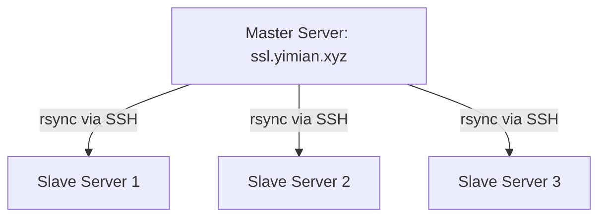

# Ushio Key-Distribution Service

This document provides an overview of the key-distribution service architecture for managing SSL certificates across a master server and multiple slave servers. The master server maintains the SSL keys, while the slave servers periodically sync their SSL directories with the master server and execute a custom Docker command if updates are detected.


## Architecture Diagram



## Architecture Overview

### Master Server
 - Hostname: ssl.yimian.xyz
 - SSL Directory: /home/ushio/ssl
 - Directory Permissions: drwxr-x---
 - Owner: ushio
 - Group: ssl

The master server maintains the SSL keys. The authorized_keys file on the master server's ssl user includes the SSH public keys of the ushio users on the slave servers to facilitate secure connections.

### Slave Servers
 - Local SSL Directory: /home/ushio/ssl
 - Cron Job: Periodically runs the sync script to ensure the local SSL directory is up-to-date with the master server's SSL directory.
 - Docker Custom Command: Executed after syncing the directories to apply the updates.

Each slave server has a cron job running periodically to:

1. Check for differences between its local SSL directory and the master server's SSL directory.
1. Sync the SSL directories if differences are found.
1. Execute a custom Docker command after syncing.

#### Sync Script
```bash
# setup cert and key fetching service
LOCAL_SSL_DIR="/home/ushio/ssl"
REMOTE_SSL_DIR="ssl@ssl.yimian.xyz:/home/ushio/ssl"
SSH_PORT=2222
DOCKER_CUSTOM_COMMAND="sudo docker ps"

# Check for differences and sync if necessary
rsync -avzic -e "ssh -p $SSH_PORT" --dry-run "$REMOTE_SSL_DIR/" "$LOCAL_SSL_DIR/" | grep -q '^>' && SYNC_NEEDED=true || SYNC_NEEDED=false

if [ "$SYNC_NEEDED" = true ]; then
    echo "Differences found. Syncing SSL directories..."
    rsync -avzc -e "ssh -p $SSH_PORT" "$REMOTE_SSL_DIR/" "$LOCAL_SSL_DIR/"
    
    echo "Running custom Docker command..."
    $DOCKER_CUSTOM_COMMAND
    
    echo "SSL directory updated and docker command executed."
else
    echo "No differences found. No action taken."
fi
```

## Key Points
 - **File Deletion Handling:** If a file is deleted on the master server, it will still be kept on the slave servers.
 - **Content Change Detection:** The slave server's Docker command is only called when file content changes, as the rsync uses checksum to detect changes.

